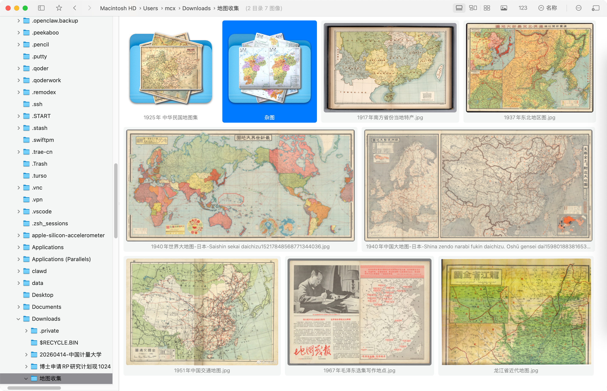

<p align="center">
<h1 align="center">FlowVision</h1>
<h3 align="center">Waterfall-style Image Viewer for macOS<br><br><a href="./README_zh.md">[中文说明]</a></h3>
</p>

[](https://github.com/netdcy/FlowVision/releases/latest?color=blue "GitHub release") 

## Screenshots



### Light Mode


### Dark Mode


## Features

### Core Features
- Adaptive layout modes (Justified, Waterfall, Grid, Detail)
- Light/Dark mode support
- Convenient file management (similar to Finder)
- Right-click gestures for quick folder navigation
- Performance optimizations for directories with large number of images
- High-quality scaling (reduces moiré and other issues)
- HDR display support
- Recursive browsing mode

### Image Features
- Support for 40+ image formats including RAW files
- Double-click to open/close large image view
- Mouse gesture zoom (hold right/left button + scroll wheel)
- Long press left button for 100% zoom
- Long press right button to fit image to view
- Image rotation and mirror flip
- OCR text recognition
- QR code detection
- EXIF information display
- Image editing mode

### Video Features
- Built-in video player with FFmpeg support
- Video seek with arrow keys
- A-B loop playback (set points with `,` and `.` keys)
- Remember playback position
- Sequential playback mode
- Video frame capture
- Auto-play visible videos option

### File Management
- Copy/Move/Delete/Rename operations
- Quick search by filename (supports pinyin)
- Quick rename with custom rules
- Custom shortcuts for copying to specified folders
- Finder tags and ratings support
- Archive file support with image extraction
- New folder creation

### Layout & Profiles
- Multiple layout types switchable
- 9 customizable profile slots
- Thumbnail size adjustment
- Sort by various criteria (name, date, size, EXIF, random)

## Installation and Usage

### System Requirements

- macOS 11.0 or Later

### Privacy and Security

- Open source
- No Internet connection required

### Homebrew Install

Initial Installation
```
brew install flowvision
```
Upgrade
```
brew update
brew upgrade flowvision
```

## Keyboard Shortcuts

### Navigation
| Key | Action |
|-----|--------|
| `W` | Go to parent directory (or zoom in large view) |
| `A` | Previous folder/image (or zoom out in large view) |
| `D` | Next folder/image |
| `S` | Return to previous directory (or zoom out in large view) |
| `Q` | Quick search / Rotate left |
| `E` | Rotate right / Close tab |
| `Space` | Open/close image or play/pause video |
| `Enter` | Open image (if enabled in settings) or rename |
| `Esc` | Close large view / Deselect all |
| `Tab` | Switch focus between sidebar and thumbnail view |

### Arrow Keys
| Key | Action |
|-----|--------|
| `←/→/↑/↓` | Navigate images or folders |
| `Cmd+↑` | Go to parent directory |
| `Cmd+↓` | Enter selected folder |
| `Cmd+←/→` | Previous/next image (or video frame seek) |
| `Shift+←/→` | Previous/next file (for video) |
| `Opt+↑/↓` | Page up/down |

### File Operations
| Key | Action |
|-----|--------|
| `R` / `F2` | Rename |
| `Delete` | Move to trash |
| `Cmd+Z` | Undo |
| `Cmd+Shift+Z` | Redo |
| `Cmd+R` / `F5` | Refresh |
| `Cmd+Shift+N` | New folder |
| `Cmd+Shift+V` | Toggle auto-play visible videos |

### Image/Video Specific
| Key | Action |
|-----|--------|
| `Z` | Zoom to 100% |
| `X` | Zoom to fit |
| `I` | Show EXIF info |
| `U` | Show file info |
| `O` | OCR text recognition |
| `P` | QR code detection |
| `,` | Set video A-B loop point A |
| `.` | Set video A-B loop point B |
| `J` | Remember video playback position |
| `K` | Toggle A-B loop playback |
| `L` | Toggle sequential playback |
| `Cmd+E` | Capture video frame |
| `Cmd+Shift+E` | Enter edit mode |

### Tags and Ratings
| Key | Action |
|-----|--------|
| `Cmd+1~9` | Toggle Finder tag (1-9) |
| `Ctrl+0~5` | Set rating (0-5 stars) |

### Profiles and Layout
| Key | Action |
|-----|--------|
| `Opt+1~9` | Switch to profile 1-9 |
| `Cmd+Opt+1~9` | Save current settings to profile 1-9 |
| `Cmd+Shift+R` | Toggle recursive mode |
| `Cmd+Shift+F` | Toggle recursive folder containment |
| `Cmd+Shift+T` | Reopen closed tab |
| `F3` | Open search |

### Window Control
| Key | Action |
|-----|--------|
| `1` | Maximize window |
| `2` | Fit window size |
| `3` | Resize window to image actual size |
| `4` | Resize window to image current size |
| `5` | Center window |
| `=` / `-` | Increase/decrease thumbnail size |
| `0` | Reset thumbnail size |
| `Opt+Enter` | Toggle fullscreen |
| `T` | Pin window to top |

### Custom Shortcuts
- Configurable shortcuts for copying files to specified folders
- Quick rename rule templates (e.g., `{folder}_{index}`)

## Right-Click Gestures

| Gesture | Action |
|---------|--------|
| Right | Next folder with images/videos |
| Left | Previous folder with images/videos |
| Up | Parent directory |
| Down | Return to previous directory |
| Up-Right | Next folder at same level |
| Down-Right | Close tab/window |

## Mouse Operations in Large View

| Operation | Action |
|-----------|--------|
| Double-click | Open/close image |
| Hold right/left + scroll | Zoom |
| Hold middle + drag | Move window |
| Long press left | 100% zoom |
| Long press right | Fit to view |

## Supported Formats

### Images
**Standard:** jpg, jpeg, png, gif, bmp, webp, tiff, ico, svg, jfif

**High Quality:** heif, heic, hif, avif, jxl, jp2

**RAW:** crw, cr2, cr3, nef, nrw, arw, srf, sr2, rw2, orf, raf, pef, dng, raw, rwl, x3f, 3fr, fff, iiq, mos, dcr, erf, mrw, gpr, srw

**Design:** ai, psd

### Videos
**Native:** mp4, mov, m2ts, ts, mpeg, mpg, m4v, vob

**FFmpeg:** mkv, mts, avi, flv, f4v, asf, wmv, rmvb, rm, webm, divx, xvid, 3gp, 3g2

## Build

### Environment

Xcode 15.2+

### Libraries

 - https://github.com/arthenica/ffmpeg-kit
 - https://github.com/attaswift/BTree
 - https://github.com/sindresorhus/Settings

### Steps

1. Clone the source code of the project and libraries.
2. For ffmpeg-kit, it needs to be built to binary first. If you want to save time, you can directly download its pre-built binary, named like `ffmpeg-kit-full-gpl-6.0-macos-xcframework.zip` (not LTS version). Unzip it, then execute this in terminal to remove its quarantine attribute:

    ```
    sudo xattr -rd com.apple.quarantine ./ffmpeg-kit-full-gpl-6.0-macos-xcframework
    ```

    (Due to the project being discontinued and copyright reasons, the prebuilt binaries have been removed. Here is a [backup](https://github.com/netdcy/ffmpeg-kit/releases/download/v6.0/ffmpeg-kit-full-gpl-6.0-macos-xcframework.zip) of original file.)

3. Organize the directory structure as shown below:

    ```
    ├── FlowVision
    │   ├── FlowVision.xcodeproj
    │   └── FlowVision
    │       └── Sources
    ├── ffmpeg-kit-build
    │   └── bundle-apple-xcframework-macos
    │       ├── ffmpegkit.xcframework
    │       └── ...
    ├── BTree
    │   ├── Package.swift
    │   └── Sources
    └── Settings
        ├── Package.swift
        └── Sources
    ```

4. Open `FlowVision.xcodeproj` by Xcode, click 'Product' -> 'Build For' -> 'Profiling' in menu bar.
5. Then 'Product' -> 'Show Build Folder in Finder', and you will find the app at `Products/Release/FlowVision.app`.

## Donate

If you found the project helpful, feel free to buy me a coffee.

[](https://buymeacoffee.com/netdcyn)

## License

This project is licensed under the GPL License. See the [LICENSE](https://github.com/netdcy/FlowVision/blob/main/LICENSE) file for the full license text.